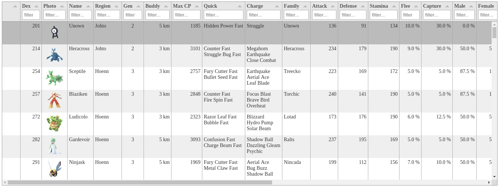

#### Screenshot

#### About

This is a utility that helps me track the Pokemon I have yet to catch in the mobile game Pokemon Go.

#### Setup

1. Modify the JS array `uncaught` to list only Pokemon with those Dex values.

#### Run

1. Run `update-files.sh` to pull down current PokemonGo data from multiple sources.
2. Open `index.html` in a browser.

#### Dependencies

- Bash
- jQuery
- Lodash
- Tabulator
